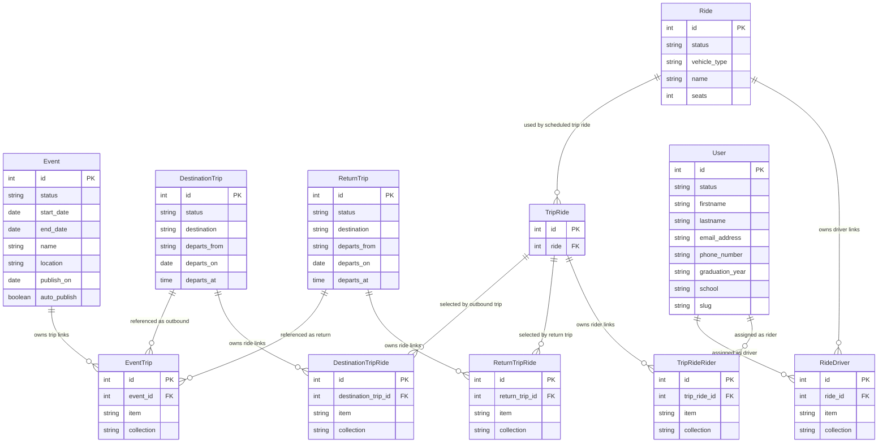

# Data Architecture & Persistence Layer

The carpool app persists its domain data in Directus-managed PostgreSQL tables, with the `event` collection acting as the top-level aggregate for trip planning. Around that root, the schema models outbound and return trips, reusable rides, rider/driver assignments, and user directory records through Directus many-to-any junction tables rather than a conventional ORM.

## Database Configuration

| Service/Module | DB Type | Profile | Driver | Connection | Migration Tool |
|---|---|---|---|---|---|
| Directus core / carpool domain | PostgreSQL 13 with PostGIS | Default runtime defined in [docker-compose.yml](/Users/robr/Documents/projects/ligerbots/ligerbots-carpool-backend/docker-compose.yml) | Directus PostgreSQL driver (`vendor: postgres` in [directus/schema.yaml](/Users/robr/Documents/projects/ligerbots/ligerbots-carpool-backend/directus/schema.yaml)) | Directus connects to the PostgreSQL service and persists tables in the mounted [database/](/Users/robr/Documents/projects/ligerbots/ligerbots-carpool-backend/database) volume | No separate migration framework detected; schema is managed through Directus and exported as snapshots in [directus/](/Users/robr/Documents/projects/ligerbots/ligerbots-carpool-backend/directus) plus SQL backups in [backups/](/Users/robr/Documents/projects/ligerbots/ligerbots-carpool-backend/backups) |

## Data Ownership per Service

| Service | Tables Owned | ORM Framework | Caching | Notes |
|---|---|---|---|---|
| Directus admin / CMS | `event`, `event_trips`, `destination_trip`, `destination_trip_rides`, `return_trip`, `return_trip_rides`, `ride`, `ride_driver`, `trip_ride`, `trip_ride_riders`, `users`, plus Directus system tables | Directus data engine over PostgreSQL, configured by [directus/schema.yaml](/Users/robr/Documents/projects/ligerbots/ligerbots-carpool-backend/directus/schema.yaml) rather than handwritten ORM entities | Redis cache enabled in runtime configuration | Owns all writes to the carpool domain and models cross-collection links with Directus junction tables |
| Directus landing-page module | None directly | Directus extension API in [module.vue](/Users/robr/Documents/projects/ligerbots/ligerbots-carpool-backend/extensions/directus-extension-module-landing-page/src/module.vue) | Uses platform cache indirectly through Directus | Reads `docs` records to render an admin-side landing page |
| Directus photos endpoint | None directly | Directus internal `FoldersService` and `FilesService` in [dist/index.js](/Users/robr/Documents/projects/ligerbots/ligerbots-carpool-backend/extensions/directus-extension-photos/dist/index.js) | Uses platform cache indirectly through Directus | Resolves folder/file metadata and redirects to Directus asset URLs |

## Entity Model

The physical schema is centered on `event`, which attaches its child trip records through the polymorphic `event_trips` junction. Each event can reference both outbound trips (`destination_trip`) and return trips (`return_trip`), and each trip can attach one or more scheduled `trip_ride` rows. A `trip_ride` chooses a reusable `ride` template, while separate junction tables attach driver and rider user records.

<!-- mermaid-checked: every attribute is `<type> <name> [<key>] ["<description>"]` with at most one of PK/FK/UK, no \n in descriptions, no {} in descriptions, every relationship label is double-quoted -->

### Collection notes

- [event](/Users/robr/Documents/projects/ligerbots/ligerbots-carpool-backend/directus/schema.yaml) is the root collection for a carpoolable activity. SQL structure is defined in [database-backup-2026100701.sql:892](/Users/robr/Documents/projects/ligerbots/ligerbots-carpool-backend/backups/database-backup-2026100701.sql:892).
- [event_trips](/Users/robr/Documents/projects/ligerbots/ligerbots-carpool-backend/directus/schema.yaml) is a Directus many-to-any junction. Its `collection` field allows `destination_trip` and `return_trip`, so one event can aggregate both outbound and return legs.
- [destination_trip](/Users/robr/Documents/projects/ligerbots/ligerbots-carpool-backend/backups/database-backup-2026100701.sql:111) and [return_trip](/Users/robr/Documents/projects/ligerbots/ligerbots-carpool-backend/backups/database-backup-2026100701.sql:1115) share the same structure: destination, origin, departure date, and departure time.
- [destination_trip_rides](/Users/robr/Documents/projects/ligerbots/ligerbots-carpool-backend/backups/database-backup-2026100701.sql:149) and [return_trip_rides](/Users/robr/Documents/projects/ligerbots/ligerbots-carpool-backend/backups/database-backup-2026100701.sql:1153) are junction tables whose `item` values point to `trip_ride`.
- [trip_ride](/Users/robr/Documents/projects/ligerbots/ligerbots-carpool-backend/backups/database-backup-2026100701.sql:1325) is the scheduled ride instance for a specific trip leg; it references a reusable [ride](/Users/robr/Documents/projects/ligerbots/ligerbots-carpool-backend/backups/database-backup-2026100701.sql:1185) record.
- [ride_driver](/Users/robr/Documents/projects/ligerbots/ligerbots-carpool-backend/directus/schema.yaml:8688) and [trip_ride_riders](/Users/robr/Documents/projects/ligerbots/ligerbots-carpool-backend/backups/database-backup-2026100701.sql:1359) are many-to-any junctions to [users](/Users/robr/Documents/projects/ligerbots/ligerbots-carpool-backend/backups/database-backup-2026100701.sql:1391), used for driver assignment and rider manifests.

## Key Repository Methods

This repository does not define conventional repository interfaces. Data access is performed through Directus extension HTTP calls and Directus internal services.

| Service | Repository | Notable Methods | Purpose |
|---|---|---|---|
| Directus landing-page module | [module.vue](/Users/robr/Documents/projects/ligerbots/ligerbots-carpool-backend/extensions/directus-extension-module-landing-page/src/module.vue) | `getPage()`, `fetch_all_pages()` | Reads `docs` records from `/items/docs` for the admin landing page UI |
| Directus photos endpoint | [dist/index.js](/Users/robr/Documents/projects/ligerbots/ligerbots-carpool-backend/extensions/directus-extension-photos/dist/index.js) | `FoldersService.readByQuery()`, `FilesService.readByQuery()` | Finds a file by folder name plus downloaded filename, then redirects to `/assets/<id>` |

## Caching Strategy

| Layer | Provider | Scope | Pattern | Notes |
|---|---|---|---|---|
| Directus runtime | Redis | Platform-level cache for Directus | Cache-aside with automatic purge | [docker-compose.yml](/Users/robr/Documents/projects/ligerbots/ligerbots-carpool-backend/docker-compose.yml) enables `CACHE_ENABLED`, `CACHE_AUTO_PURGE`, and `CACHE_STORE=redis` |
| Directus custom extensions | Inherit Directus runtime behavior | API/service calls | No custom cache logic detected | Neither extension implements its own TTL or invalidation rules |

## Data Ownership Boundaries

The system uses a shared PostgreSQL database managed by Directus. The Directus runtime is the only write path visible in the repository for the carpool domain; custom extensions consume data through Directus APIs or Directus services instead of talking to PostgreSQL directly.

For the carpool domain, `event` is the aggregate root. The physical model uses polymorphic junctions to keep trip composition flexible:

- `event_trips` links an event to either `destination_trip` or `return_trip`
- `destination_trip_rides` and `return_trip_rides` link a trip leg to one or more `trip_ride` rows
- `trip_ride` selects a reusable `ride`
- `ride_driver` and `trip_ride_riders` connect people in `users` to the assigned ride instance

This gives the app one shared data store with logical separation by collection rather than database-per-service boundaries. No CQRS split, dedicated read replica, or direct cross-service SQL access layer was detected.

### Data Classification & Sensitivity

| Entity | Sensitive Fields | Classification | Controls in Place |
|---|---|---|---|
| `users` | `firstname`, `lastname`, `email_address`, `phone_number`, `parents_email_address`, `emergency_phone_number`, `children`, `address`, `city`, `state`, `zipcode`, `parent_names`, `password` | PII | No schema-level encryption, masking, or field-level controls are visible in the exported schema; Directus role permissions may exist, but they are not documented in the checked-in artifacts |
| `ride_driver` / `trip_ride_riders` | Indirect references to `users` via junction rows | PII | No additional controls beyond parent user records are visible |
| `event`, `destination_trip`, `return_trip`, `ride`, `trip_ride` | Scheduling and capacity data only | None | No special controls needed beyond normal application access control |
| `global` | `restart_secret`, `refresh_secret`, `mode_change_secret` | None | Contains operational secrets rather than PII, PHI, or PCI; values appear stored in the database, with no dedicated secret-management integration visible in the repository |
